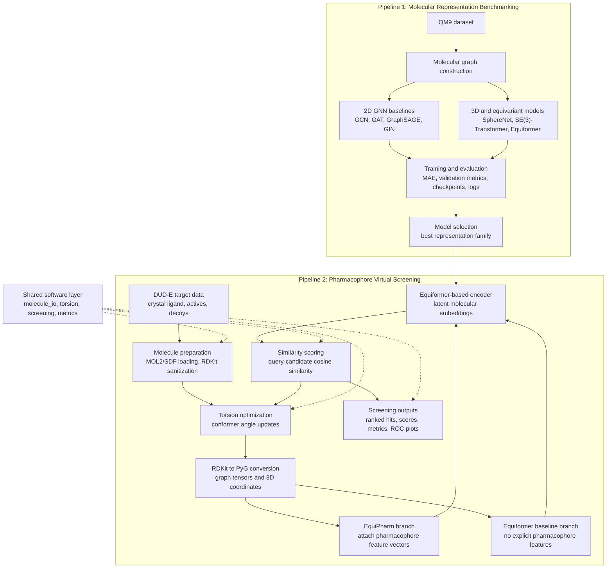

# EquiPharm: An AI Approach for Pharmacophore Screening

## Architecture



## Overview

EquiPharm is an end-to-end research framework for molecular representation learning and pharmacophore-based virtual screening. The repository connects two complementary pipelines: a benchmarking pipeline for selecting strong molecular graph encoders, and a pharmacophore screening pipeline that applies the selected representation strategy to ligand ranking on DUD-E targets.

The first part of the framework evaluates multiple 2D and 3D graph neural network architectures on QM9. These experiments compare classical molecular graph baselines with geometry-aware and equivariant models in order to identify representations that can capture both molecular topology and spatial structure.

The second part of the framework builds on that model-selection stage. It uses Equiformer-based molecular embeddings, torsion optimization, pharmacophore feature extraction, and active-versus-decoy evaluation to support structure-based virtual screening. In this way, the repository is organized as a connected research workflow: benchmark the representation model first, then use the strongest representation family inside a pharmacophore screening system.

## Framework Design

The project is organized around two connected pipelines.

### 1. Benchmarking Pipeline

The benchmarking pipeline evaluates molecular representation models on the QM9 dataset. It includes 2D GNN baselines and 3D molecular learning models:

- GCN
- GAT
- GraphSAGE
- GIN
- SphereNet
- SE(3)-Transformer
- Equiformer
- Equiformer point-cloud and adjacency-aware variants

This stage provides a controlled comparison of model families and produces checkpoints, metrics, logs, and result files that can be used to guide downstream model selection.

### 2. Pharmacophore Screening Pipeline

The pharmacophore pipeline applies the selected 3D representation approach to virtual screening on DUD-E targets. It contains two maintained screening workflows:

- `EquiPharm`: an Equiformer-based workflow that attaches RDKit pharmacophore features to molecular graphs before encoding.
- `Equiformer_with_optimization`: a baseline Equiformer screening workflow with the same torsion optimization and active/decoy evaluation flow, but without explicit pharmacophore feature attachment.

Both workflows use shared utilities for molecule loading, RDKit-to-PyG conversion, torsion optimization, scoring, metric calculation, and plot generation. This keeps the screening logic reproducible while allowing direct comparison between pharmacophore-aware and non-pharmacophore-aware representations.

## Repository Structure

```text
benchmarking/
  Methods/                         # QM9 benchmark models and shared training utilities
  results/                         # Benchmark notebooks and exploratory outputs

pharmacophore/
  EquiPharm/                       # Pharmacophore-feature-aware screening pipeline
  Equiformer_with_optimization/    # Equiformer screening baseline with torsion optimization
  core/                            # Shared molecule IO, screening, metrics, and torsion utilities
  legacy/                          # Original exploratory scripts preserved for traceability
  notebooks/                       # Research notebooks from the exploratory stage
  results/                         # Reference screening outputs and plots

figures/                           # Project figures and result visualizations
pic/                               # README and project overview images
```

## Datasets

- `QM9`: used for benchmarking molecular representation models.
- `DUD-E`: used for pharmacophore screening, active/decoy ranking, and evaluation.

DUD-E data and trained checkpoints are expected to be stored locally and are not committed to the repository.

Expected DUD-E target layout:

```text
data/DUD-E/<target>/
  crystal_ligand.mol2
  actives_sdf/
  decoys_sdf/
```

## Installation

Create the project environment from the repository environment file:

```bash
conda env create -f environment.yml
conda activate <environment-name>
```

The benchmark models are GPU-oriented and expect a CUDA-enabled PyTorch setup for full training runs.

## Running the Benchmarking Pipeline

Benchmarking entry points are located in `benchmarking/Methods/`. Example commands:

```bash
python benchmarking/Methods/GCN.py --epochs 10 --device cuda
python benchmarking/Methods/GAT.py --epochs 10 --device cuda
python benchmarking/Methods/GIN.py --epochs 10 --device cuda
python benchmarking/Methods/SAGE.py --epochs 10 --device cuda
python benchmarking/Methods/spherenet.py --epochs 10 --device cuda
python benchmarking/Methods/se3transformer.py --epochs 10 --device cuda
python benchmarking/Methods/equiformer_adj.py --epochs 10 --device cuda
python benchmarking/Methods/equiformer_pt_cloud.py --epochs 10 --device cuda
```

Each benchmark run writes reproducible artifacts under `runs/<model>/`, including the configuration, best validation/test metrics, checkpoints, and logs.

For a quick smoke test:

```bash
python benchmarking/Methods/GAT.py \
  --epochs 1 \
  --train-size 256 \
  --valid-size 64 \
  --batch-size 32 \
  --eval-batch-size 64 \
  --device cuda
```

## Running the Pharmacophore Screening Pipeline

Run the pharmacophore-aware EquiPharm workflow:

```bash
python -m pharmacophore.EquiPharm.cli \
  --target-dir data/DUD-E/<target> \
  --target-name <target> \
  --checkpoint checkpoints/equipharm/best_model.pt \
  --output-dir pharmacophore/results/EquiPharm/<target>
```

Run the Equiformer optimization baseline:

```bash
python -m pharmacophore.Equiformer_with_optimization.cli \
  --target-dir data/DUD-E/<target> \
  --target-name <target> \
  --checkpoint checkpoints/equiformer/best_model.pt \
  --output-dir pharmacophore/results/Equiformer_with_optimization/<target>
```

Both pipelines can also be launched from example config files:

```bash
python -m pharmacophore.EquiPharm.cli \
  --config pharmacophore/EquiPharm/configs/target.example.json

python -m pharmacophore.Equiformer_with_optimization.cli \
  --config pharmacophore/Equiformer_with_optimization/configs/target.example.json
```

## Outputs

Screening runs write target-specific results such as:

```text
pharmacophore/results/<pipeline>/<target>/
  scores.csv
  ranked_hits.csv
  metrics.json
  cosine_similarity_boxplot.png
  roc_curve_actives_vs_decoys.png
```

These outputs support comparison between active and decoy molecules through ranking metrics, score distributions, and ROC analysis.

## Tests

Run the lightweight software smoke tests:

```bash
python -m unittest pharmacophore.tests.test_cli_smoke
```

These tests check the maintained command-line interfaces without requiring full DUD-E data or trained checkpoints.

## Project Status

This repository is under active development as part of a master thesis project. The current codebase preserves exploratory notebooks and legacy scripts for traceability, while the maintained workflows are organized around reproducible benchmark and screening entry points.

## Project Information

**Author:** Ismail Cherkaoui Aadil  
**Institute:** Institut of Medical Bioinformatics Systems, Hamburg  
**Project:** Master thesis project
