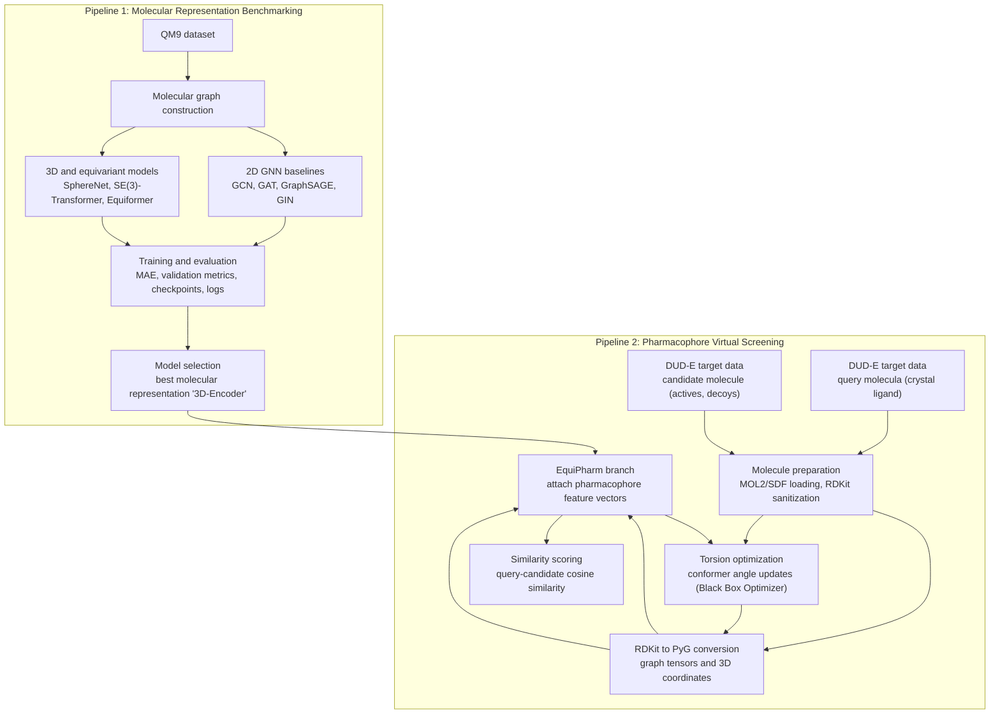

# EquiPharm: An AI Approach for Pharmacophore Screening

## Architecture



## Overview

EquiPharm is an end-to-end research framework for molecular representation learning and pharmacophore-based virtual screening. The repository connects two complementary pipelines: a benchmarking pipeline for selecting strong molecular graph encoders, and a pharmacophore screening pipeline that applies the selected representation strategy to ligand ranking on DUD-E targets.

The first part of the framework evaluates multiple 2D and 3D graph neural network architectures on QM9. These experiments compare classical molecular graph baselines with geometry-aware and equivariant models in order to identify representations that can capture both molecular topology and spatial structure.

The second part of the framework builds on that model-selection stage. It uses Equiformer-based molecular embeddings, torsion optimization, pharmacophore feature extraction, and active-versus-decoy evaluation to support structure-based virtual screening. In this way, the repository is organized as a connected research workflow: benchmark the representation model first, then use the strongest representation family inside a pharmacophore screening system.

## Framework Design

The project is organized around two connected pipelines.

### 1. Benchmarking Pipeline

The benchmarking pipeline evaluates molecular representation models on the QM9 dataset. It includes 2D GNN baselines and 3D molecular learning models:

- GCN
- GAT
- GraphSAGE
- GIN
- SphereNet
- SE(3)-Transformer
- Equiformer
- Equiformer point-cloud and adjacency-aware variants

This stage provides a controlled comparison of model families and produces checkpoints, metrics, logs, and result files that can be used to guide downstream model selection.

### 2. Pharmacophore Screening Pipeline

The pharmacophore pipeline applies the selected 3D representation approach to virtual screening on DUD-E targets. It contains maintained screening workflows and external baseline adapters:

- `EquiPharm`: an Equiformer-based workflow that attaches RDKit pharmacophore features to molecular graphs before encoding.
- `EquiPharm_Hungarian`: embedding-space Hungarian assignment ranked by negative average Euclidean distance between matched feature embeddings.
- `EquiPharm_Hungarian_v2`: embedding-space Hungarian assignment ranked by negative average pairwise Euclidean geometry-distance error in embedding space.
- `Equiformer_hungarian_v3`: Euclidean embedding-space Hungarian assignment ranked by negative average pairwise 3D geometry-distance error.
- `EquiPharm_Hungarian_3D`: Hungarian assignment directly on 3D pharmacophore feature-center distances, then ranks by negative average pairwise 3D geometry-distance error.
- `EquiPharm_Hungarian_Cosine`: Hungarian feature matching ranked by mean matched-pair embedding cosine similarity.
- `EquiPharm_Hungarian_Cosine_v2`: Hungarian feature matching ranked by internal embedding cosine-geometry preservation.
- `Equiformer_with_optimization`: a baseline Equiformer screening workflow with the same torsion optimization and active/decoy evaluation flow, but without explicit pharmacophore feature attachment.
- `CDPKit`, `PharmacoMatch`, `SchrodingerPhase`, `OpenPharmaco`, `Pharmit`, and `DiscoveryStudio`: optional external baseline adapters.

The Hungarian variants use `benchmarking.Methods.equiformer_encoder_matching` to expose feature-level pharmacophore embeddings before assignment scoring. Their cost matrix allows same-family pharmacophore matches, such as donor-to-donor or aromatic-to-aromatic, and sets incompatible pairs to `Inf`. After matching, the spatial variants use 3D pharmacophore distances, while the cosine variants use embedding cosine similarity and cosine-distance geometry.

These workflows use shared utilities for molecule loading, RDKit-to-PyG conversion, torsion optimization, scoring, metric calculation, and plot generation. This keeps the screening logic reproducible while allowing direct comparison between pharmacophore-aware, matching-based, and external screening methods.

## Repository Structure

```text
benchmarking/
  Methods/                         # QM9 benchmark models and shared training utilities
  results/                         # Benchmark notebooks and exploratory outputs

pharmacophore/
  EquiPharm/                       # Pharmacophore-feature-aware screening pipeline
  EquiPharm_Hungarian/             # Feature-level Hungarian matching pipeline
  EquiPharm_Hungarian_v2/          # Spatial geometry Hungarian matching pipeline
  Equiformer_hungarian_v3/         # Embedding-assignment 3D-scoring Hungarian pipeline
  EquiPharm_Hungarian_3D/          # 3D feature-center Hungarian matching pipeline
  EquiPharm_Hungarian_Cosine/      # Matched cosine Hungarian matching pipeline
  EquiPharm_Hungarian_Cosine_v2/   # Cosine geometry Hungarian matching pipeline
  CDPKit/                          # CDPKit external baseline adapter
  PharmacoMatch/                   # PharmacoMatch command-template adapter
  SchrodingerPhase/                # Schrodinger Phase command-template adapter
  OpenPharmaco/                    # OpenPharmaco command-template adapter
  Pharmit/                         # Pharmit command-template adapter
  DiscoveryStudio/                 # Discovery Studio command-template adapter
  Equiformer_with_optimization/    # Equiformer screening baseline with torsion optimization
  core/                            # Shared molecule IO, screening, metrics, and torsion utilities
  legacy/                          # Original exploratory scripts preserved for traceability
  notebooks/                       # Research notebooks from the exploratory stage
  results/                         # Reference screening outputs and plots

figures/                           # Project diagrams, README images, and result visualizations
models_checkpt/                    # Helper script for downloading the trained model checkpoint
scripts/                           # Dataset and checkpoint preparation helpers
```

## Datasets

- `QM9`: used for benchmarking molecular representation models.
- `DUD-E`: used for pharmacophore screening, active/decoy ranking, and evaluation.
- `LIT-PCBA`: optional virtual-screening benchmark with active/inactive target sets.
- `DEKOIS 2.0`: optional active/decoy benchmark for retrospective virtual screening.
- `BayesBind`: optional structure-based virtual-screening benchmark.

Datasets and trained checkpoints are expected to be stored locally and are not committed to the repository.

Download and prepare both datasets in the paths used by the code:

```bash
bash scripts/download_datasets.sh
```

This downloads DUD-E from the official DUD-E all-target archive:

```text
http://dude.docking.org/db/subsets/all/all.tar.gz
```

and prepares it as:

```text
data/DUD-E/<target>/
  crystal_ligand.mol2
  actives_sdf/
  decoys_sdf/
```

The script also downloads QM9 through `torch_geometric.datasets.QM9` into:

```text
data/QM9/
```

To download only one dataset:

```bash
bash scripts/download_datasets.sh dude
bash scripts/download_datasets.sh qm9
```

Additional screening datasets can be downloaded from their official distributions and normalized into the same target layout:

```bash
LIT_PCBA_URL="<official-lit-pcba-archive-url>" bash scripts/download_datasets.sh lit-pcba
DEKOIS2_URL="<official-dekois2-archive-url>" bash scripts/download_datasets.sh dekois2
BAYESBIND_URL="<official-bayesbind-archive-url>" bash scripts/download_datasets.sh bayesbind
```

If you already downloaded or unpacked one of these datasets manually, normalize it directly:

```bash
python scripts/prepare_screening_dataset.py \
  --source-dir path/to/LIT-PCBA \
  --output-dir data/LIT-PCBA

python scripts/prepare_screening_dataset.py \
  --source-dir path/to/DEKOIS2 \
  --output-dir data/DEKOIS2

python scripts/prepare_screening_dataset.py \
  --source-dir path/to/BayesBind \
  --output-dir data/BayesBind
```

The normalized screening layout is:

```text
data/<dataset>/<target>/
  crystal_ligand.mol2  # or crystal_ligand.sdf
  actives_sdf/
  decoys_sdf/
```

After this setup, the default benchmark path `data/QM9` and screening paths such as `data/DUD-E/<target>`, `data/LIT-PCBA/<target>`, `data/DEKOIS2/<target>`, and `data/BayesBind/<target>` are ready to use without moving files.

## Model Checkpoint

The trained checkpoint used for the maintained EquiPharm model is stored outside the repository. Download it with:

```bash
bash models_checkpt/download_checkpoint.sh
```

The script creates:

```text
models_checkpt/checkpoint_02-05-26/best_model.pt
```

Use this path when running the screening pipeline:

```bash
python -m pharmacophore.EquiPharm.cli \
  --target-dir data/DUD-E/<target> \
  --target-name <target> \
  --checkpoint models_checkpt/checkpoint_02-05-26/best_model.pt \
  --output-dir pharmacophore/results/EquiPharm/<target>
```

## Installation

Create the project environment from the repository environment file:

```bash
conda env create -f environment.yml
conda activate <environment-name>
```

The benchmark models are GPU-oriented and expect a CUDA-enabled PyTorch setup for full training runs.

## Docker

Build the CPU-oriented project image:

```bash
docker build -t equipharm:latest .
```

Run a shell inside the container:

```bash
docker run --rm -it -v "$PWD:/workspace" equipharm:latest
```

Or use Docker Compose:

```bash
docker compose run --rm equipharm
```

Start the individual named container:

```bash
docker compose up -d equipharm
docker exec -it equipharm bash
docker compose down
```

Run the smoke tests in Docker:

```bash
docker run --rm equipharm:latest python -m unittest pharmacophore.tests.test_cli_smoke
```

Large local assets such as `data/`, `checkpoints/`, and `runs/` are excluded from image builds. Mount them into `/workspace` when running screening or training jobs.

## Running the Benchmarking Pipeline

Benchmarking entry points are located in `benchmarking/Methods/`. Example commands:

```bash
python benchmarking/Methods/GCN.py --epochs 10 --device cuda
python benchmarking/Methods/GAT.py --epochs 10 --device cuda
python benchmarking/Methods/GIN.py --epochs 10 --device cuda
python benchmarking/Methods/SAGE.py --epochs 10 --device cuda
python benchmarking/Methods/spherenet.py --epochs 10 --device cuda
python benchmarking/Methods/se3transformer.py --epochs 10 --device cuda
python benchmarking/Methods/equiformer_pt_cloud.py --epochs 10 --device cuda
```

Each benchmark run writes reproducible artifacts under `runs/<model>/`, including the configuration, best validation/test metrics, checkpoints, and logs. A recovery checkpoint is saved after every completed epoch at `runs/<model>/checkpoints/last_checkpoint.pt`; rerunning the same command with the same `--output-dir` automatically resumes from it. Use `--resume-from <checkpoint>` to choose a specific checkpoint or `--no-auto-resume` to start fresh in an existing output directory.

The adjacency-aware Equiformer entry point is configured with Equiformer-style QM9 defaults: AdamW, cosine warmup scheduling, EMA, train/validation sizes of 110k/10k, and three repeated split/training seeds. A full comparison run is:

```bash
python benchmarking/Methods/equiformer_adj.py --device cuda
```

This writes per-seed runs under `runs/EquiformerAdj/seed_<seed>/` and a cross-seed summary at `runs/EquiformerAdj/seed_summary.csv`. To run a smaller seed set, pass:

```bash
python benchmarking/Methods/equiformer_adj.py --seeds 1 2 --device cuda
```

For a quick smoke test:

```bash
python benchmarking/Methods/GAT.py \
  --epochs 1 \
  --train-size 256 \
  --valid-size 64 \
  --batch-size 32 \
  --eval-batch-size 64 \
  --device cuda
```

For a quick EquiformerAdj smoke test, override the multi-seed defaults:

```bash
python benchmarking/Methods/equiformer_adj.py \
  --epochs 1 \
  --seeds 1 \
  --train-size 256 \
  --valid-size 64 \
  --batch-size 32 \
  --eval-batch-size 64 \
  --device cuda
```

## Running the Pharmacophore Screening Pipeline

Run the pharmacophore-aware EquiPharm workflow:

```bash
python -m pharmacophore.EquiPharm.cli \
  --target-dir data/DUD-E/<target> \
  --target-name <target> \
  --checkpoint models_checkpt/checkpoint_02-05-26/best_model.pt \
  --output-dir pharmacophore/results/EquiPharm/<target>
```

Run the Equiformer optimization baseline:

```bash
python -m pharmacophore.Equiformer_with_optimization.cli \
  --target-dir data/DUD-E/<target> \
  --target-name <target> \
  --checkpoint checkpoints/equiformer/best_model.pt \
  --output-dir pharmacophore/results/Equiformer_with_optimization/<target>
```

Run the feature-level Hungarian matching variant:

```bash
python -m pharmacophore.EquiPharm_Hungarian.cli \
  --target-dir data/DUD-E/<target> \
  --target-name <target> \
  --checkpoint models_checkpt/checkpoint_02-05-26/best_model.pt \
  --output-dir pharmacophore/results/EquiPharm_Hungarian/<target>
```

Run the geometry-distance Hungarian matching variant:

```bash
python -m pharmacophore.EquiPharm_Hungarian_v2.cli \
  --target-dir data/DUD-E/<target> \
  --target-name <target> \
  --checkpoint models_checkpt/checkpoint_02-05-26/best_model.pt \
  --output-dir pharmacophore/results/EquiPharm_Hungarian_v2/<target>
```

Run the matched-cosine Hungarian matching variant:

```bash
python -m pharmacophore.EquiPharm_Hungarian_Cosine.cli \
  --target-dir data/DUD-E/<target> \
  --target-name <target> \
  --checkpoint models_checkpt/checkpoint_02-05-26/best_model.pt \
  --output-dir pharmacophore/results/EquiPharm_Hungarian_Cosine/<target>
```

Run the cosine-geometry Hungarian matching variant:

```bash
python -m pharmacophore.EquiPharm_Hungarian_Cosine_v2.cli \
  --target-dir data/DUD-E/<target> \
  --target-name <target> \
  --checkpoint models_checkpt/checkpoint_02-05-26/best_model.pt \
  --output-dir pharmacophore/results/EquiPharm_Hungarian_Cosine_v2/<target>
```

EquiPharm-family screening runs are resumable. Each completed molecule is appended to `scores.csv` inside the selected `--output-dir`; if the server interrupts the job, rerun the same command and already-scored molecule paths are skipped:

```bash
python -m pharmacophore.EquiPharm_Hungarian_v2.cli \
  --target-dir data/DUD-E/<target> \
  --target-name <target> \
  --checkpoint models_checkpt/checkpoint_02-05-26/best_model.pt \
  --output-dir pharmacophore/results/EquiPharm_Hungarian_v2/<target>
```

To force a fresh run, remove the target output directory or its `scores.csv` first.

Run CDPKit, PharmacoMatch, SchrodingerPhase, OpenPharmaco, Pharmit, DiscoveryStudio, EquiPharm, and all Hungarian variants together and aggregate their CSV tables:

```bash
python -m pharmacophore.run_all_screening \
  --dataset-dir data/DUD-E \
  --checkpoint models_checkpt/checkpoint_02-05-26/best_model.pt \
  --output-dir pharmacophore/results \
  --pharmacomatch-command-template "python screen.py --query {query_ligand} --candidate {candidate}" \
  --pharmacomatch-score-json-key score \
  --phase-command-template "phase_screen --query {query_ligand} --candidate {candidate} --json" \
  --phase-score-json-key score \
  --openpharmaco-command-template "openpharmaco_screen --query {query_ligand} --candidate {candidate}" \
  --openpharmaco-score-regex "score[:=]\\s*([-+0-9.eE]+)" \
  --pharmit-command-template "pharmit_screen --query {query_ligand} --candidate {candidate} --json" \
  --pharmit-score-json-key score \
  --discoverystudio-command-template "discovery_studio_pharmacophore_screen --query {query_ligand} --candidate {candidate} --json" \
  --discoverystudio-score-json-key score \
  --exclude-pipeline EquiPharm_Hungarian \
  --exclude-pipeline EquiPharm_Hungarian_v2
```

Run the same all-method pipeline on additional normalized datasets by changing `--dataset-dir`:

Include the same `--phase-*`, `--openpharmaco-*`, `--pharmit-*`, and `--discoverystudio-*` command-template options when you want those external baselines included for the dataset.

```bash
python -m pharmacophore.run_all_screening \
  --dataset-dir data/LIT-PCBA \
  --checkpoint models_checkpt/checkpoint_02-05-26/best_model.pt \
  --output-dir pharmacophore/results \
  --pharmacomatch-command-template "python screen.py --query {query_ligand} --candidate {candidate}" \
  --pharmacomatch-score-json-key score

python -m pharmacophore.run_all_screening \
  --dataset-dir data/DEKOIS2 \
  --checkpoint models_checkpt/checkpoint_02-05-26/best_model.pt \
  --output-dir pharmacophore/results \
  --pharmacomatch-command-template "python screen.py --query {query_ligand} --candidate {candidate}" \
  --pharmacomatch-score-json-key score

python -m pharmacophore.run_all_screening \
  --dataset-dir data/BayesBind \
  --checkpoint models_checkpt/checkpoint_02-05-26/best_model.pt \
  --output-dir pharmacophore/results \
  --pharmacomatch-command-template "python screen.py --query {query_ligand} --candidate {candidate}" \
  --pharmacomatch-score-json-key score
```

The Python pipelines can also be launched from example config files:

```bash
python -m pharmacophore.EquiPharm.cli \
  --config pharmacophore/EquiPharm/configs/target.example.json

python -m pharmacophore.EquiPharm_Hungarian.cli \
  --config pharmacophore/EquiPharm_Hungarian/configs/target.example.json

python -m pharmacophore.EquiPharm_Hungarian_v2.cli \
  --config pharmacophore/EquiPharm_Hungarian_v2/configs/target.example.json

python -m pharmacophore.EquiPharm_Hungarian_Cosine.cli \
  --config pharmacophore/EquiPharm_Hungarian_Cosine/configs/target.example.json

python -m pharmacophore.EquiPharm_Hungarian_Cosine_v2.cli \
  --config pharmacophore/EquiPharm_Hungarian_Cosine_v2/configs/target.example.json

python -m pharmacophore.Equiformer_with_optimization.cli \
  --config pharmacophore/Equiformer_with_optimization/configs/target.example.json

python -m pharmacophore.SchrodingerPhase.cli \
  --config pharmacophore/SchrodingerPhase/configs/target.example.json

python -m pharmacophore.OpenPharmaco.cli \
  --config pharmacophore/OpenPharmaco/configs/target.example.json

python -m pharmacophore.Pharmit.cli \
  --config pharmacophore/Pharmit/configs/target.example.json

python -m pharmacophore.DiscoveryStudio.cli \
  --config pharmacophore/DiscoveryStudio/configs/target.example.json
```

## Outputs

Single-pipeline screening runs write target-specific results such as:

```text
pharmacophore/results/<pipeline>/<target>/
  scores.csv
  ranked_hits.csv
  metrics.json
  screening_performance_summary.csv
  auroc_curve_coordinates.csv
  cosine_similarity_boxplot.png
  roc_curve_actives_vs_decoys.png       # EquiPharm-family pipelines
  <pipeline>_<target>_auroc_curve.png   # EquiPharm and Hungarian variants
```

The all-method runner also writes:

```text
pharmacophore/results/<dataset>/
  all_screening_metrics.csv
  all_screening_scores.csv
  <pipeline>/
    <target>/
      scores.csv
      ranked_hits.csv
      metrics.json
      screening_performance_summary.csv
      auroc_curve_coordinates.csv
      roc_curve_actives_vs_decoys.png       # EquiPharm-family pipelines
      <pipeline>_<target>_auroc_curve.png   # EquiPharm and Hungarian variants
```

Examples:

```text
pharmacophore/results/DUD-E/all_screening_metrics.csv
pharmacophore/results/LIT-PCBA/all_screening_metrics.csv
pharmacophore/results/DEKOIS2/all_screening_metrics.csv
pharmacophore/results/BayesBind/all_screening_metrics.csv
```

These dataset-specific outputs support comparison between active and decoy molecules through AUROC, PR-AUC, EF1%, BEDROC(alpha=20), score distributions, and ROC analysis without mixing benchmark sources.

## Tests

Run the lightweight software smoke tests:

```bash
python -m unittest pharmacophore.tests.test_cli_smoke
```

These tests check the maintained command-line interfaces without requiring full DUD-E data or trained checkpoints.

## Project Status

This repository is under active development as part of a master thesis project. The current codebase preserves exploratory notebooks and legacy scripts for traceability, while the maintained workflows are organized around reproducible benchmark and screening entry points.

## Project Information

**Author:** Ismail Cherkaoui Aadil  
**Institute:** Institut of Medical Bioinformatics Systems, Hamburg  
**Project:** Master thesis project
