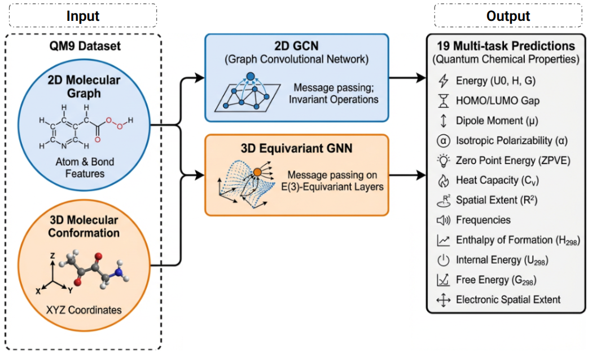

# Benchmarking Methods

<p align="center">
  
</p>

This directory contains the GPU-oriented QM9 benchmark models and shared training utilities.

## Shared pipeline

- `benchmark_utils.py` - QM9 loading, target conversion, normalization, training, logging, checkpointing, and result export.
- `train_eval.py` - one-epoch training and evaluation helpers.

## Dependencies

These benchmarks are GPU-first and expect a CUDA-enabled PyTorch environment.
Core packages:

- `torch`
- `torch-geometric`
- `torch-scatter`
- `ase`
- `tensorboard`
- `dig`
- `equiformer-pytorch`
- `se3-transformer-pytorch`

## 2D GNN baselines

- `GCN.py` - Graph Convolutional Network.
- `GAT.py` - Graph Attention Network.
- `GIN.py` - Graph Isomorphism Network.
- `SAGE.py` - GraphSAGE.

## 3D / equivariant baselines

- `spherenet.py` - SphereNet baseline.
- `se3transformer.py` - SE(3)-Transformer baseline.
- `equiformer_adj.py` - adjacency-aware Equiformer training entry point.
- `equiformer_architecture.py` - adjacency-aware Equiformer architecture.
- `equiformer_pt_cloud.py` - point-cloud Equiformer baseline.
- `equiformer_official.py` - launcher for the authors' original, single-target QM9 implementation.
- `equiformer_official_benchmark.py` - original backbone adapted to the shared 19-target pipeline.

## Pharmacophore-oriented model

- `equiformer_encoder_pharmaco_feat.py` - Equiformer variant used by the pharmacophore workflow.
- `equiformer.py` - legacy pharmacophore-aware Equiformer variant kept for compatibility.

## GPU Commands

Run training through the entry point scripts:

```bash
python benchmarking/Methods/GCN.py --epochs 10 --device cuda
python benchmarking/Methods/GAT.py --epochs 10 --device cuda
python benchmarking/Methods/GIN.py --epochs 10 --device cuda
python benchmarking/Methods/SAGE.py --epochs 10 --device cuda
python benchmarking/Methods/spherenet.py --epochs 10 --device cuda
python benchmarking/Methods/se3transformer.py --epochs 10 --device cuda
python benchmarking/Methods/equiformer_pt_cloud.py --epochs 10 --device cuda
```

Each run writes a reproducible output directory:

```text
runs/<model>/
  config.json
  best_val_test_mae.csv
  checkpoints/best_model.pt
  checkpoints/last_checkpoint.pt
  logs/
```

Training automatically writes `checkpoints/last_checkpoint.pt` after every completed epoch.
If a run is interrupted, launch the same command again with the same `--output-dir`; the
benchmark will resume from that checkpoint and continue at the next epoch. To resume from
a specific file, pass:

```bash
python benchmarking/Methods/GCN.py \
  --resume-from runs/GCN/checkpoints/last_checkpoint.pt \
  --device cuda
```

Use `--no-auto-resume` when you intentionally want to ignore an existing recovery
checkpoint and start a fresh run in the same output directory.

The adjacency-aware Equiformer now uses the authors' base QM9 recipe: 300 epochs,
batch size 128, AdamW (`lr=5e-4`, `weight_decay=5e-3`, `eps=1e-8`), L1
loss, five warmup epochs from `1e-6`, cosine decay to `1e-6`, and no EMA or
drop path. It uses the authors' fixed 110k/10k split generated with split seed 1;
the repeated seeds change model initialization and training randomness.
These choices are taken from the
[official QM9 scripts](https://github.com/atomicarchitects/equiformer/tree/64cb7866f48b9aa156e74a9d6a2ef2663b367437/scripts/train/qm9/equiformer)
and the [ICLR 2023 paper](https://openreview.net/pdf?id=KwmPfARgOTD).

```bash
python benchmarking/Methods/equiformer_adj.py --device cuda
```

## QM9 target selection

The repository-native adjacency and point-cloud models, plus the adapted official
backbone, can train all 19 QM9 targets (the default), a named target group, or one
target. Use a separate output directory for each experiment so checkpoints from
different output heads cannot be mixed.

The `electronic` preset contains the six requested electronic properties:
dipole moment, polarizability, HOMO, LUMO, HOMO-LUMO gap, and electronic spatial
extent. The `geometry` preset contains rotational constants A, B, and C.
`electronic_geometry` is the union of those groups (nine targets).

```bash
# Geometry group
python benchmarking/Methods/equiformer_adj.py \
  --target-preset geometry --fixed-split --split-seed 1 --output-dir runs/EquiformerAdj/geometry --device cuda
python benchmarking/Methods/equiformer_pt_cloud.py \
  --target-preset geometry --fixed-split --split-seed 1 --output-dir runs/EquiformerPointCloud/geometry --device cuda
python benchmarking/Methods/equiformer_official_benchmark.py \
  --target-preset geometry --fixed-split --split-seed 1 --output-dir runs/EquiformerOfficialBenchmark/geometry --device cuda

# Electronic group
python benchmarking/Methods/equiformer_adj.py \
  --target-preset electronic --fixed-split --split-seed 1 --output-dir runs/EquiformerAdj/electronic --device cuda
python benchmarking/Methods/equiformer_pt_cloud.py \
  --target-preset electronic --fixed-split --split-seed 1 --output-dir runs/EquiformerPointCloud/electronic --device cuda
python benchmarking/Methods/equiformer_official_benchmark.py \
  --target-preset electronic --fixed-split --split-seed 1 --output-dir runs/EquiformerOfficialBenchmark/electronic --device cuda

# Electronic and geometry groups together (9 targets)
python benchmarking/Methods/equiformer_adj.py \
  --target-preset electronic_geometry --fixed-split --split-seed 1 --output-dir runs/EquiformerAdj/electronic_geometry --device cuda
python benchmarking/Methods/equiformer_pt_cloud.py \
  --target-preset electronic_geometry --fixed-split --split-seed 1 --output-dir runs/EquiformerPointCloud/electronic_geometry --device cuda
python benchmarking/Methods/equiformer_official_benchmark.py \
  --target-preset electronic_geometry --fixed-split --split-seed 1 --output-dir runs/EquiformerOfficialBenchmark/electronic_geometry --device cuda

# All 19 targets
python benchmarking/Methods/equiformer_adj.py \
  --target-preset all --fixed-split --split-seed 1 --output-dir runs/EquiformerAdj/all --device cuda
python benchmarking/Methods/equiformer_pt_cloud.py \
  --target-preset all --fixed-split --split-seed 1 --output-dir runs/EquiformerPointCloud/all --device cuda
python benchmarking/Methods/equiformer_official_benchmark.py \
  --target-preset all --fixed-split --split-seed 1 --output-dir runs/EquiformerOfficialBenchmark/all --device cuda

# One target (replace homo with any canonical target listed below)
python benchmarking/Methods/equiformer_adj.py \
  --target homo --output-dir runs/EquiformerAdj/homo --device cuda
python benchmarking/Methods/equiformer_pt_cloud.py \
  --target homo --output-dir runs/EquiformerPointCloud/homo --device cuda
python benchmarking/Methods/equiformer_official_benchmark.py \
  --target homo --output-dir runs/EquiformerOfficialBenchmark/homo --device cuda
```

These grouped commands are multi-target extensions. The authors' original QM9
experiments train one scalar property per process; therefore there is no published
author hyperparameter set specifically for a 6-, 9-, or 19-output run. The shared
adjacency and adapted-official runs use the base author recipe above consistently.
The point-cloud model keeps its architecture-specific training defaults, while the
explicit fixed-split flags make its data partition comparable.

Valid `--target` names are:

```text
dipole_moment, polarizability, homo, lumo, homo_lumo_gap,
electronic_spatial_extent, zpve, u0, u, h, g, heat_capacity,
u0_atom, u_atom, h_atom, g_atom, rotational_constant_a,
rotational_constant_b, rotational_constant_c
```

## Original Equiformer reproduction

The local `equiformer_adj.py` architecture is an adjacency-aware experiment built
with the third-party `equiformer-pytorch` package; it is not the original ICLR
2023 implementation. For an author-faithful comparison, first clone the official
MIT-licensed implementation:

```bash
git clone https://github.com/atomicarchitects/equiformer \
  external/equiformer_official
git -C external/equiformer_official checkout 64cb7866f48b9aa156e74a9d6a2ef2663b367437
```

The original experiment predicts one target per model and publishes settings for
the first 12 standard QM9 tasks, not a joint 19-output model. The launcher keeps
that design: a preset starts independent target/seed processes using the authors'
target-specific Gaussian/Bessel basis, dropout, epoch, batch-size, optimizer, and
standardization choices.

The launcher generates a checkpoint-enabled copy of the pinned upstream training
entry point without modifying the authors' `main_qm9.py`. Each target/seed run
writes `checkpoints/last_checkpoint.pt` after every epoch and updates
`checkpoints/best_model.pt` whenever validation MAE improves. These checkpoints
contain model/EMA weights, optimizer and scheduler states, target statistics,
best metrics, and the complete run configuration.

The official data code fixes the split at 110,000 training molecules, 10,000
validation molecules, and the remainder for testing using split seed 1. The
launcher `--seeds` vary model initialization and loader randomness only. Use the
repository-native Equiformer entry points when varying `--train-size`,
`--valid-size`, or `--split-seed`; doing so is a new experiment rather than an
exact reproduction.

```bash
# Reproduce all 12 targets, each with seeds 1, 2, and 3
python benchmarking/Methods/equiformer_official.py \
  --target-preset official_all --seeds 1 2 3

# The six electronic targets with different training seeds
python benchmarking/Methods/equiformer_official.py \
  --target-preset electronic --seeds 4 5 6 \
  --output-dir runs/EquiformerOfficial/electronic_seeds_4_5_6

# One target and arbitrary seeds
python benchmarking/Methods/equiformer_official.py \
  --target homo --seeds 7 11 19 \
  --output-dir runs/EquiformerOfficial/homo

# Inspect every generated command without requiring PyTorch or the checkout
python benchmarking/Methods/equiformer_official.py \
  --target-preset electronic --seeds 1 --dry-run
```

Targets supported by the official QM9 code are `dipole_moment`,
`polarizability`, `homo`, `lumo`, `homo_lumo_gap`,
`electronic_spatial_extent`, `zpve`, `u0`, `u`, `h`, `g`, and
`heat_capacity`. The geometry preset from the shared 19-target benchmark cannot
be called an exact reproduction because the authors did not publish QM9 runs for
rotational constants A/B/C in their implementation.

### Original backbone with this repository's setup

`equiformer_official_benchmark.py` loads the six-block network directly from the
pinned official checkout and runs it through our target selection, normalization,
split-seed, checkpoint, CSV, and repeated-seed pipeline. Its invariant readout is
expanded from one scalar to the selected number of targets. This is the original
backbone with our experimental setup, not an exact reproduction of the authors'
single-target experiment.

Install the updated environment and clone the source as shown above. The added
`e3nn==0.4.4`, `torch-scatter`, and `torch-cluster` dependencies are required by
the original network. The PyG compiled wheels are selected for the repository's
PyTorch 2.7.0/CUDA 12.8 stack.

```bash
# All 19 targets, seeds 1/2/3 on the authors' fixed split
python benchmarking/Methods/equiformer_official_benchmark.py \
  --target-preset all --seeds 1 2 3 --fixed-split --split-seed 1 \
  --output-dir runs/EquiformerOfficialBenchmark/all --device cuda

# Six electronic targets with explicit training seeds
python benchmarking/Methods/equiformer_official_benchmark.py \
  --target-preset electronic --seeds 4 5 6 --fixed-split --split-seed 1 \
  --output-dir runs/EquiformerOfficialBenchmark/electronic --device cuda

# Fixed data split, one target, one training seed
python benchmarking/Methods/equiformer_official_benchmark.py \
  --target homo --seeds 7 11 19 --fixed-split --split-seed 1 \
  --output-dir runs/EquiformerOfficialBenchmark/homo --device cuda

# Geometry targets and custom data sizes
python benchmarking/Methods/equiformer_official_benchmark.py \
  --target-preset geometry --seeds 1 2 3 \
  --train-size 100000 --valid-size 10000 \
  --output-dir runs/EquiformerOfficialBenchmark/geometry --device cuda
```

For `equiformer_adj.py` and `equiformer_official_benchmark.py`, repeated `--seeds`
hold the split at seed 1 by default, matching the official experiment. The explicit
flags in the command matrix make that choice visible and also apply it to the
point-cloud runner.

By default this runs seeds `1 2 3`, writes per-seed outputs under `runs/EquiformerAdj/seed_<seed>/`, and writes `runs/EquiformerAdj/seed_summary.csv`. To compare fewer seeds:

```bash
python benchmarking/Methods/equiformer_adj.py --seeds 1 2 --device cuda
```

## Smoke Test

For a quick GPU smoke test, reduce the split sizes:

```bash
python benchmarking/Methods/GAT.py \
  --epochs 1 \
  --train-size 256 \
  --valid-size 64 \
  --batch-size 32 \
  --eval-batch-size 64 \
  --device cuda
```

For an EquiformerAdj smoke test, also override the multi-seed default:

```bash
python benchmarking/Methods/equiformer_adj.py \
  --epochs 1 \
  --seeds 1 \
  --train-size 256 \
  --valid-size 64 \
  --batch-size 32 \
  --eval-batch-size 64 \
  --device cuda
```

Use `--device cpu` only for local syntax or data-pipeline checks when a GPU is unavailable.

## Import Safety

Benchmark entry points should be import-safe: importing a model file must not load QM9 or start training.
Use the model classes/builders directly in downstream pipelines:

```python
from benchmarking.Methods.GAT import GATModel
from benchmarking.Methods.equiformer_architecture import EquiformerQM9
from benchmarking.Methods.equiformer_pt_cloud import EquiformerQM9PointCloud
```
