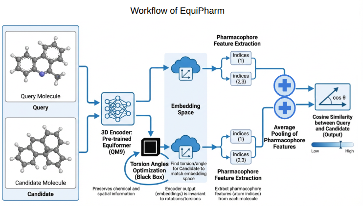

# Pharmacophore Screening

<p align="center">
  
</p>

This directory contains two reproducible screening pipelines plus the original exploratory notebooks/scripts.
DUD-E data and model checkpoints are not committed to the repository; paths are supplied through config files or CLI arguments.

## Pipelines

### EquiPharm

Folder: `pharmacophore/EquiPharm/`

This is the pharmacophore-feature-aware pipeline, cleaned from the `legacy/pharmacophore-opt-ph-Copy2.features.py` style workflow.
Before encoding a molecule, it extracts RDKit pharmacophore features and attaches them to the PyG graph:

```python
data.pharmacophore_features = model.pharmaco_features(mol)
```

Run:

```bash
python -m pharmacophore.EquiPharm.cli \
  --target-dir data/DUD-E/<target> \
  --target-name <target> \
  --checkpoint checkpoints/equipharm/best_model.pt \
  --output-dir pharmacophore/results/EquiPharm/<target>
```

Or run from a config file:

```bash
python -m pharmacophore.EquiPharm.cli \
  --config pharmacophore/EquiPharm/configs/target.example.json
```

### Equiformer With Optimization

Folder: `pharmacophore/Equiformer_with_optimization/`

This is the plain Equiformer screening pipeline with the same torsion optimization and active/decoy evaluation flow.
It does not attach pharmacophore features before encoding and is useful as a direct baseline.

Run:

```bash
python -m pharmacophore.Equiformer_with_optimization.cli \
  --target-dir data/DUD-E/<target> \
  --target-name <target> \
  --checkpoint checkpoints/equiformer/best_model.pt \
  --output-dir pharmacophore/results/Equiformer_with_optimization/<target>
```

Or run from a config file:

```bash
python -m pharmacophore.Equiformer_with_optimization.cli \
  --config pharmacophore/Equiformer_with_optimization/configs/target.example.json
```

## Expected Data Layout

Keep DUD-E locally outside git:

```text
data/DUD-E/<target>/
  crystal_ligand.mol2
  actives_sdf/
  decoys_sdf/
```

Examples:

```text
data/DUD-E/aces/
data/DUD-E/urok/
data/DUD-E/egfr/
```

## Configs

Each pipeline has an example target config:

```text
pharmacophore/EquiPharm/configs/target.example.json
pharmacophore/Equiformer_with_optimization/configs/target.example.json
```

Replace `<target>` with the DUD-E target name or override paths from the command line.

## Outputs

Each run writes:

```text
pharmacophore/results/<pipeline>/<target>/
  scores.csv
  ranked_hits.csv
  metrics.json
  cosine_similarity_boxplot.png
  roc_curve_actives_vs_decoys.png
```

`metrics.json` and `scores.csv` include the pipeline name and protein target name.
If `--target-name` is omitted, the target is inferred from paths like `data/DUD-E/<target>/...`.

Existing reference plots and CSV exports from the exploratory workflow are kept in:

```text
pharmacophore/results/
  results_pharmaco_AUROC.csv
  cosine_similarity_boxplot.png
  roc_curve_actives_vs_decoys.png
```

## Smoke Tests

Use `--limit` before launching full DUD-E screening:

```bash
python -m pharmacophore.EquiPharm.cli \
  --target-dir data/DUD-E/aces \
  --checkpoint checkpoints/equipharm/best_model.pt \
  --output-dir pharmacophore/results/EquiPharm/aces_smoke \
  --limit 100
```

Run the lightweight software smoke tests without DUD-E data or checkpoints:

```bash
python -m unittest pharmacophore.tests.test_cli_smoke
```

## Shared Utilities

The two pipelines share:

- `core/molecule_io.py` - MOL2/SDF readers, molecule preparation, RDKit-to-PyG conversion.
- `core/torsion.py` - black-box torsion optimization.
- `core/screening.py` - generic screening engine used by both pipelines.
- `core/metrics.py` - metrics and plot generation.

## Legacy Scripts

Older exploratory Python scripts are preserved in `legacy/` for traceability.
They are useful for comparison while reviewing the migration, but the maintained software entry points are the two pipeline CLIs.

## Reference Notebooks

The original notebooks and copied experiment scripts are kept as references during migration, including:

- `notebooks/pharmacophore-opt.ipynb`
- `notebooks/pharmacophore-opt-expt.ipynb`
- `notebooks/pharmacophore-opt-ph.features.ipynb`
- `notebooks/pharmacophore-without-opt.ipynb`
- `notebooks/visualization-pharmaphore.ipynb`
- `legacy/pharmacophore-opt-ph.features.py`
- `legacy/pharmacophore-opt-ph-Copy*.features.py`
- `legacy/tm_calculate.py`

They are not the recommended reproducible entry points.
